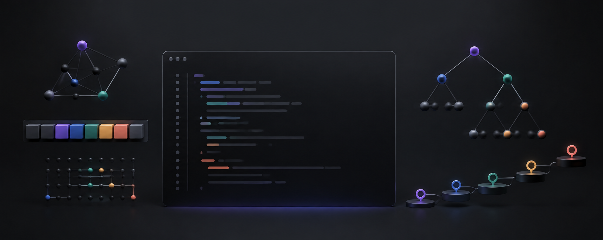

<div align="center">

# Algo Arena

### Ace the coding interview, one problem at a time.

A focused, self-hosted practice platform with **2,936 algorithm problems**, a guided roadmap, and a real six-language code judge.

</div>

<p align="center">
  <a href="#quick-start"><strong>Quick start</strong></a> ·
  <a href="#what-you-get">Features</a> ·
  <a href="#how-the-judge-works">The judge</a> ·
  <a href="#deployment">Deployment</a> ·
  <a href="#contributing">Contributing</a>
</p>

<p align="center">
  
  
  
  
  
</p>

<p align="center">
  
</p>

Algo Arena brings the complete interview-practice loop into one focused workspace: choose a pattern, solve a problem in a VS Code-grade editor, run real test cases, study the explanation, and watch your progress compound.

It is free, open, and designed to run on infrastructure you control. Practice without an account, keep progress locally, or sign in to sync progress on your own instance.

> **No account. No paywall. No external judge.** Your code runs on your machine or your own server.

## Why Algo Arena

- **A path, not a pile.** Follow a curated 150-problem roadmap across 18 interview patterns, from arrays and sliding windows to graphs and dynamic programming.
- **Room to go deeper.** Search a 2,786-problem archive; 1,752 archive problems have generated, judge-validated tests and full coding workspaces.
- **Your code actually runs.** Execute Python, JavaScript, TypeScript, Java, C++, and Dart locally—no external judging service required.
- **Learn after every attempt.** Every curated problem includes an editorial, reference solutions, and time and space complexity.
- **Own your progress.** Track solved and attempted problems, submissions, category coverage, and streaks. Export an encrypted backup whenever you like.

## Quick start

### Docker — all languages included

The easiest way to run the complete platform is Docker. The image includes Node.js and every judge runtime.

```bash
git clone https://github.com/sky1095/algo-arena.git
cd algo-arena
docker compose up -d --build
```

Open [http://localhost:3000](http://localhost:3000).

### Local setup

Local installation requires **Node.js 24 or newer** because Algo Arena uses Node's built-in SQLite module.

```bash
git clone https://github.com/sky1095/algo-arena.git
cd algo-arena
npm run setup
```

The setup command checks Node.js, installs dependencies, starts the development server, reports which judge runtimes are available, and opens the app.

Available setup modes:

```bash
npm run setup           # local development
npm run setup:prod      # production build and local server
npm run setup:docker    # complete Docker environment
npm run setup:runtimes  # install missing host runtimes
```

Missing runtimes do not prevent Algo Arena from starting. Only submissions in the missing language will fail with a clear compiler/runtime message.

## The complete practice loop

<table>
  <tr>
    <td width="25%" align="center"><strong>1 · Pick</strong><br><sub>Follow the roadmap or search the library.</sub></td>
    <td width="25%" align="center"><strong>2 · Solve</strong><br><sub>Code in a focused Monaco workspace.</sub></td>
    <td width="25%" align="center"><strong>3 · Verify</strong><br><sub>Run visible tests, then submit hidden ones.</sub></td>
    <td width="25%" align="center"><strong>4 · Learn</strong><br><sub>Study the editorial and track mastery.</sub></td>
  </tr>
</table>

<p align="center">
  
  
</p>

## What you get

| Experience | What it provides |
| --- | --- |
| **Curated roadmap** | 150 essential interview problems organized into 18 patterns |
| **Problem library** | 2,786 additional classic problems with search and difficulty filtering |
| **Coding workspace** | Split problem/editor layout powered by Monaco, the editor behind VS Code |
| **Real judge** | Compile and run against visible and hidden tests with per-case verdicts |
| **Editorials** | Explanations, reference implementations, and complexity analysis |
| **Progress** | Solved/attempted state, submission history, streaks, and category coverage |
| **Portable backups** | Client-side encrypted progress export and import |
| **Flexible install** | Browser app, installable PWA, Docker deployment, or Electron desktop build |

### Six judge languages

| Language | Required local runtime |
| --- | --- |
| Python | `python3` |
| JavaScript | `deno` |
| TypeScript | `deno` |
| Java | `javac` and `java` from a JDK |
| C++ | `g++` |
| Dart | `dart` from the Dart SDK |

On Windows, Python may also resolve through `py` or `python`. If a native runtime is missing, the judge can fall back to the default WSL2 distribution.

## Explore by pattern

The roadmap turns common interview techniques into a sequence you can work through deliberately:

- Arrays & hash tables
- Two pointers and sliding window
- Stacks, binary search, and linked lists
- Trees, tries, heaps, and backtracking
- Graphs and advanced graphs
- Dynamic programming
- Greedy algorithms, intervals, math, and bit manipulation

Use the searchable problem list for the core roadmap or jump into the complete archive when you want more repetition.

<table>
  <tr>
    <td width="50%"></td>
    <td width="50%"></td>
  </tr>
  <tr>
    <td align="center"><sub><strong>Roadmap</strong> — master one interview pattern at a time</sub></td>
    <td align="center"><sub><strong>Problems</strong> — filter by difficulty, category, and progress</sub></td>
  </tr>
</table>

<p align="center">
  
  <br><sub><strong>Library</strong> — go beyond the roadmap with 2,786 additional problems</sub>
</p>

## Progress that belongs to you

You can start practicing without creating an account; guest progress stays in browser storage. On a self-hosted instance, accounts add server-side progress and submission history.

From **Stats**, users can export their data and restore or merge it on another Algo Arena instance. Backups are encrypted in the browser with PBKDF2-SHA256 and AES-256-GCM using the account password. The password and encryption key are not stored in the export.

Server-side state remains deliberately simple:

- SQLite stores users and sessions.
- Each account has an independent progress JSON file.
- `data/` contains all persistent instance state and is the only directory operators need to back up.

## Install as an app

### Progressive Web App

Run a production build:

```bash
npm run setup:prod
```

Then use the browser's **Install Algo Arena** action. The service worker caches the application shell, icons, and local Monaco assets, so the interface launches quickly and provides a friendly recovery screen if the server is offline.

The judge still runs on the server. Installing the PWA does not make code execution fully offline, and installation requires `localhost` or HTTPS.

To make the local production server available whenever the PWA opens:

```bash
npm run launch             # start when needed and open the app
npm run launch:autostart   # register startup at login
```

Autostart supports macOS launchd, Linux systemd, and Windows Task Scheduler. Add `--remove` to undo it or `--dry-run` to preview the changes.

### Electron

Build the desktop application with:

```bash
npm run electron:build
```

## How the judge works

When a user selects **Run** or **Submit**, Algo Arena:

1. Loads the problem definition, starter contract, and applicable test cases.
2. Generates a small language-specific harness around the submitted solution.
3. Compiles or executes it in an isolated temporary directory.
4. Captures structured result and error markers.
5. Compares the output using the problem's comparator.
6. Returns per-test results, including expected and actual output, compile failures, runtime errors, and timeouts.

Comparators understand regular values as well as trees, graphs, linked lists, multiple valid answers, and in-place mutations. Hidden tests are checked against editorial solutions through the development audit route.

## Deployment

Algo Arena is best deployed as its provided Docker container on a VPS or container host:

```bash
docker compose up -d --build
```

The container exposes port `3000`, includes all six judge runtimes, and mounts `./data` for durable accounts and progress. Put Caddy, Nginx, or Traefik in front for HTTPS and a custom domain.

Back up the `data/` directory before upgrades or host migrations.

### Security model

The included container is appropriate for personal use and trusted communities:

- Judge processes run as an unprivileged `judge` user, never root.
- Account and progress files are not readable by that judge user.
- Each submission receives a separate temporary working directory.
- Judge, signup, signin, and password-verification endpoints are rate-limited per IP.
- Submission source is limited to 50 KB.
- Passwords use per-user salted scrypt hashes.
- Sessions use opaque random tokens in `httpOnly` cookies.
- Development audit and debug routes return `404` in production.

> [!WARNING]
> Submission processes have wall-clock timeouts but do not currently have hard memory limits, CPU quotas, or blocked network access. Do not expose the bundled judge to hostile multi-tenant traffic. Use gVisor, nsjail, isolated per-submission containers, or an external judge service for an internet-facing public deployment.

The built-in rate limiter is process-local. Multi-instance deployments need a shared rate-limit store such as Redis.

## Application routes

| Route | Purpose |
| --- | --- |
| `/` | Dashboard, daily problem, stats, and category overview |
| `/problems` | Search and filter the curated roadmap |
| `/problems/[slug]` | Solve, run, submit, and read solutions |
| `/library` | Browse the complete archive |
| `/library/[slug]` | Solve supported archive problems or read view-only entries |
| `/roadmap` | Track progress across all 18 patterns |
| `/profile` | Review streaks, difficulty mix, submissions, and category progress |

## Project structure

```text
src/
  app/
    api/judge/       run and submit endpoint
    api/audit/       development-only test validation
    problems/        roadmap and workspace pages
    library/         archive browser and workspaces
  lib/
    judge/           harnesses, execution, and output comparison
    data/            categories and problem definitions
    auth.ts          accounts and session handling
    db.ts            SQLite account storage
    progress.tsx     client progress state and portability
    progress-store.ts server-side per-user progress files
electron/            desktop application wrapper
public/vs/           self-hosted Monaco editor assets
scripts/             setup, runtime installation, and app launchers
```

## Development

```bash
npm install
npm run dev
```

Before opening a pull request:

```bash
npm run lint
npm run build
```

The development server prints the detected language runtimes at startup. Install the relevant toolchain before testing changes to a judge language.

## Contributing

Contributions are welcome, whether you are adding your first problem or extending the judge itself.

Good places to start:

- Add a problem with starter code, tests, and an editorial.
- Add a judge language, input type, or output comparator.
- Improve the workspace, library, roadmap, or statistics experience.
- Strengthen sandboxing, accessibility, or test coverage.
- Improve explanations and problem hints.

Please describe the behavior you changed and include the verification you ran. Never commit real account data from `data/`.

## License

No license file is currently included. Until a license is added, normal copyright restrictions apply to the source code.
