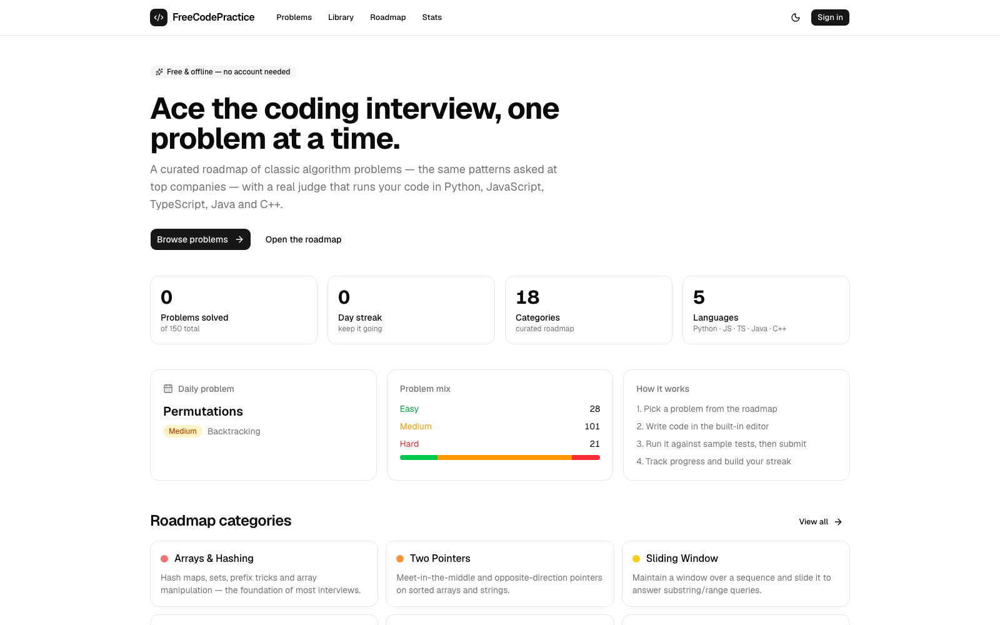
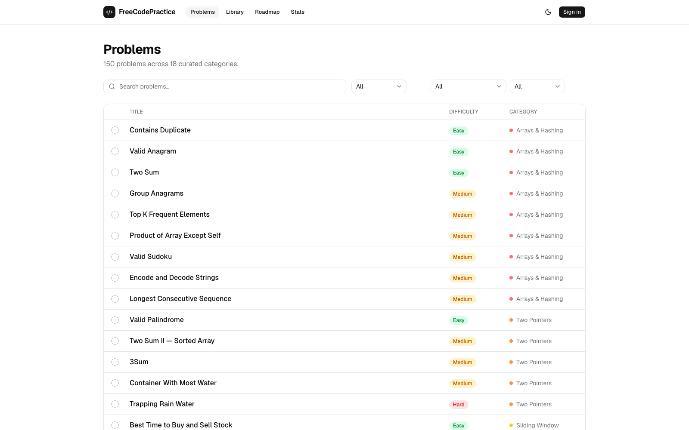
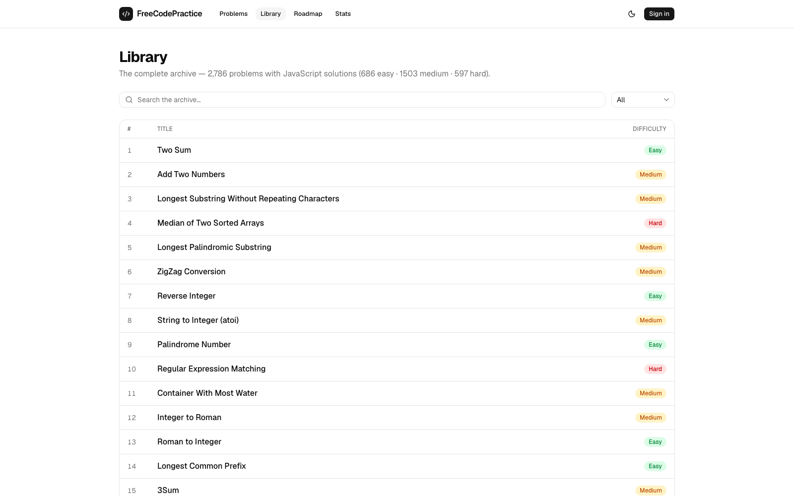
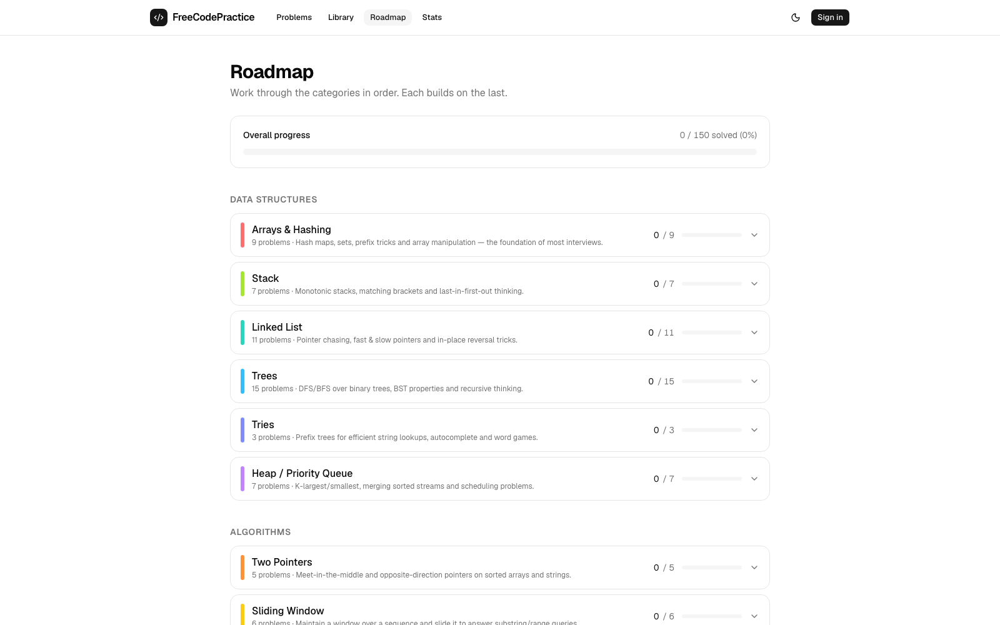
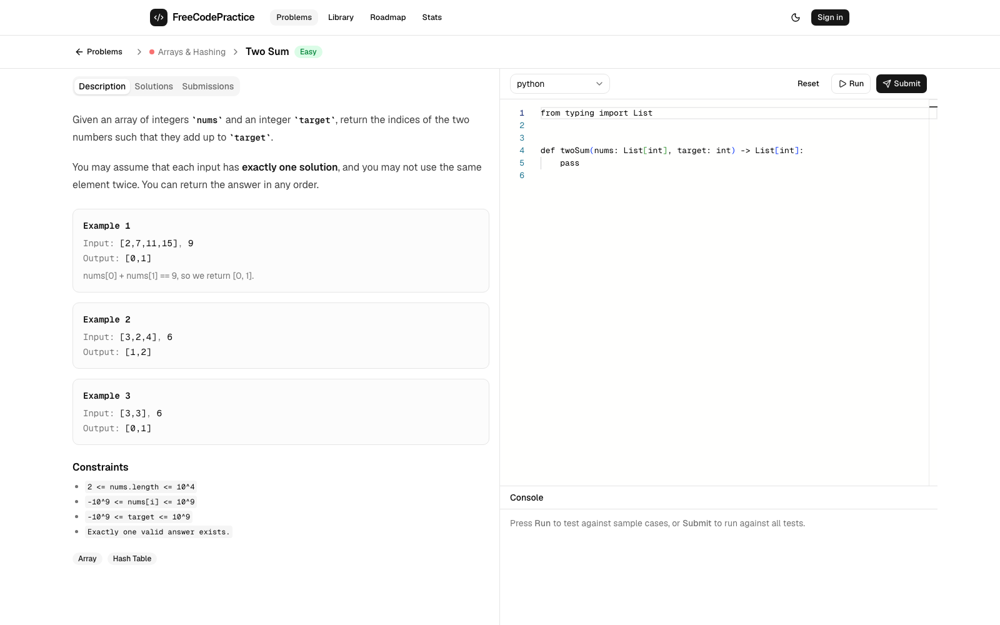

# FreeCodePractice — Coding Interview Practice

A coding interview practice platform: a curated roadmap of classic algorithm problems with a real judge that runs your code.

- **150 curated problems** across **18 categories** (Arrays & Hash Tables → Bit Manipulation)
- **Library archive**: every problem from a public open-source archive of classic problems (2,786 problems, 1 → 3,623). **1,752 of them are fully solvable** — auto-generated, judge-validated tests with a workspace in Python, JavaScript and TypeScript (the rest are view-only: tree/linked-list/design problems whose solutions can't be auto-tested)
- **Real judge** that compiles and runs your code in **Python, JavaScript, TypeScript, Java, and C++** (local subprocesses — no external service)
- **Monaco editor** (VS Code's editor) with syntax highlighting, served fully offline from `/public/vs`
- **Run / Submit** with per-test results: expected vs. actual output, runtime errors, timeouts, and compile errors
- **Editorial solutions** with approach explanations and time/space complexity for every problem
- **Progress tracking** (solved/attempted, submissions history, streak) stored in `localStorage`
- **Dark / light mode**, shadcn UI components, fully responsive



## Getting started

```bash
npm install
npm run dev
```

Open [http://localhost:3000](http://localhost:3000).

> The judge requires local runtimes for the languages you test: `python3`, `node`, `tsx` (via node), `javac`/`java`, and `g++`. Missing runtimes report a clear compile error in the console.

## Pages

| Route | Description |
| --- | --- |
| `/` | Homepage with stats, daily problem, and category overview |
| `/problems` | Searchable, filterable list of all problems with status icons |
| `/library` | Complete archive (2,786 problems) with search and difficulty filter |
| `/library/[slug]` | Archive problem — judged ones open the full workspace (editor, Run/Submit, Solutions), the rest show the JS solution |
| `/roadmap` | Category roadmap: 18 categories with per-category progress |
| `/problems/[slug]` | Workspace: description, editor, console, Solutions & Submissions tabs |
| `/profile` | Stats page: difficulty breakdown, streak, category progress |

  

## Architecture

```
src/
  app/
    api/judge/    POST judge endpoint (run/submit)
    api/audit/    dev-only: validates every problem's tests against its editorial solution
    problems/     list + workspace pages
  lib/
    judge/        harness.ts (per-language code generation), judge.ts (orchestration),
                  runner.ts (subprocess execution), compare.ts (output comparison)
    data/         problems/ (one file per category), categories.ts
    progress.tsx  localStorage-backed progress store (context)
    types.ts      shared types (Problem, InputType, JudgeOutcome, ...)
```

## How the judge works

`/api/judge` takes `{ slug, lang, code, mode }`. The harness generates a `Main` program per language that constructs each test case from literals, calls your `Solution`/function, serializes results as `@@RESULT` / `@@ERROR` markers, and runs it in a sandboxed subprocess (time/memory limits). The judge parses those markers, compares outputs (with special handling for trees, graphs, linked lists, multi-answer any-order, and in-place `void` mutations), and returns a per-test verdict.



## Data model

Each problem defines visible + hidden tests, per-language starter code and editorials, input types (`int[]`, `tree`, `graph`, `linked`, class specs for Tries, ...), and an output comparator. Hidden tests are validated automatically by `/api/audit`, which runs every editorial solution through the real judge.

## Welcome, students! 🎓

This project is **free and open for anyone to practice on** — no account, no sign-up, no paywall. Clone it, run it locally, and start grinding:

```bash
git clone <repo-url>
cd algo-arena
npm install
npm run dev
```

- **2,936 problems** to practice with: a curated 150-problem interview roadmap plus a 2,786-problem archive
- **5 languages** supported by the judge: Python, JavaScript, TypeScript, Java, and C++
- Every problem has editorial solutions with approach explanations and time/space complexity
- Your progress (solved, attempts, streak) is saved locally — pick up where you left off

## Contributing

We'd love your help, whether you're a first-time open-source contributor or a seasoned dev. Good first contributions:

- **Add a problem** — drop a new file in `src/lib/data/problems/` with tests, starter code, and an editorial
- **Extend the judge** — support a new language in `src/lib/judge/`, or a new input type / output comparator
- **Improve the UI** — the workspace, library, roadmap, or profile pages (shadcn + Tailwind)
- **Fix a bug or a flaky test** — run `npm run build` and `npm run lint` before opening a PR
- **Write docs** — better README, category guides, or per-problem hints

### Getting started as a contributor

1. Fork the repo and clone your fork
2. Create a branch: `git checkout -b my-change`
3. Make your changes, then verify with `npm run build` and `npm run lint`
4. Open a pull request describing what you changed and why

> The judge runs code locally via subprocesses, so you'll need `python3`, `node`, `tsx`, `javac`/`java`, and `g++` installed to test those languages.

Happy coding! 🚀
